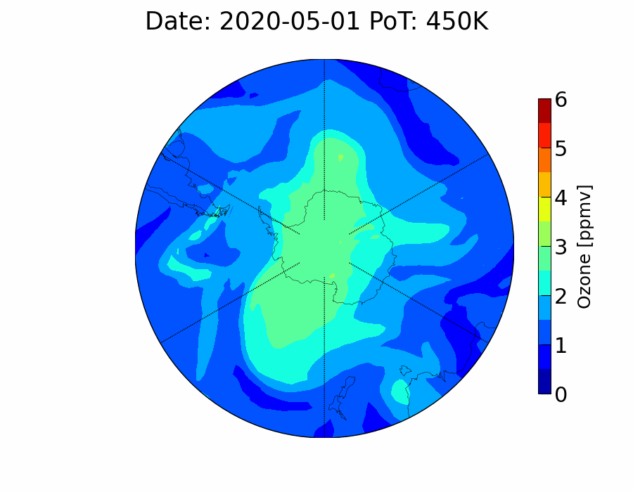

Reading and conversion of [Reprobus model](https://cds-espri.ipsl.upmc.fr/etherTypo/index.php?id=1664&L=1) output to isentropic co-ordinates.

## Reprobus overview

REPROBUS (Reactive Processes Ruling the Ozone Budget in the Stratosphere) is a CTM (Chemistry Transport Model) that describes stratospheric chemistry with 55 chemical species and more than 100 chemical reactions. Heterogeneous chemistry upon Polar Stratospheric Clouds and aerosol particles is parameterised within the model. Transport of the chemical species are assured by a semi-Lagrangian scheme.

[List of species from Reprobus](species.md)

## Usage

repro.f90 should be compiled with f2py using:

```python
f2py -c repro.f90 -m repro
```

and then readfile function can be used in python after importing repro as a module

```python
from reprobus import Reprobus

filename = 'MODEL_history_2020120412_001437'
ncfile = 'ex.nc'
bus = Reprobus(filename)
print(f"Saving %s" % ncfile)
bus.data[["Ozone", "POx"]].to_netcdf(ncfile)
```

See [example notebook](./example.ipynb) for an example use case.



**Note:** Reprobus codes should be compiled with 8-byte real numbers. So use appropriate flags for different compilers.